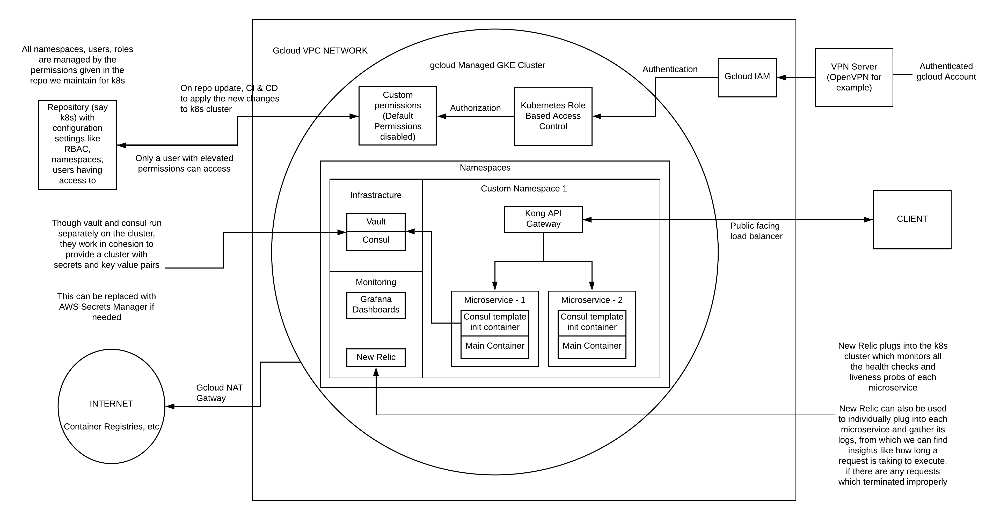
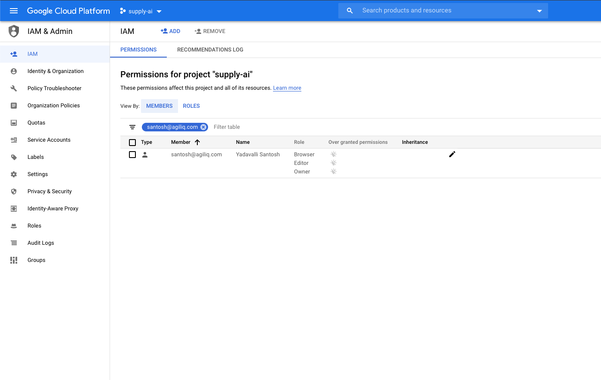
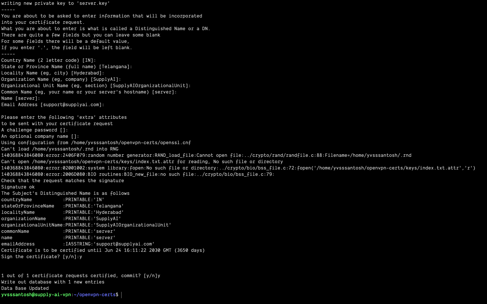
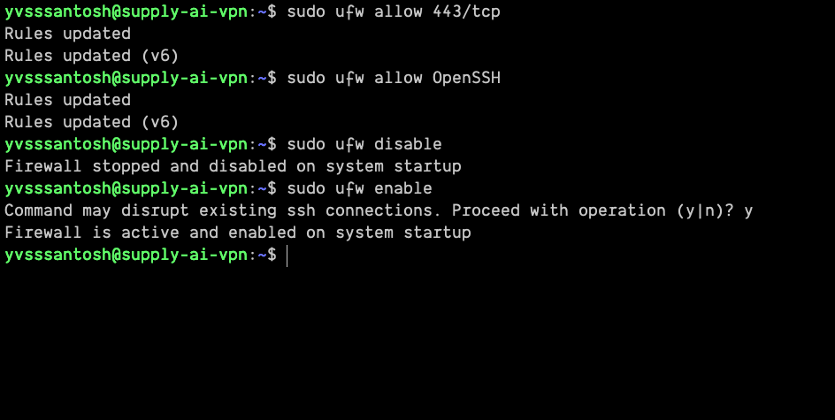
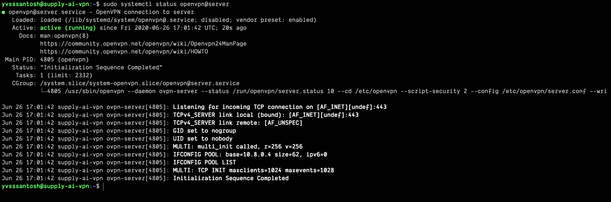

# Deploying Microservice Architectured Applications on a Private k8s cluster and accessing it via VPN



## Watch the video
[](https://www.youtube.com/watch?v=EAQUkPQBNjU)


In this tutorial we'll install a VPN (OpenVPN Server) and connect to our k8s cluster via the VPN. In a private k8s cluster, the nodes have reserved IP addresses only, which ensures that their workloads are isolated from the public internet. 

The tutorial involves:
1. IAM Access to gcloud
2. Creating a VPN Server
3. Creating a Private GKE Cluster
4. Creating a NAT Gateway for internet connectivity to the cluster

## IAM Access to gcloud
The organization owner usually has full permissions to create members and add members in gcloud. This process is pretty straight forward, so we can expect a user to be having access to:
1. Create a GCP instance (which we'll use to setup OpenVPNServer)
2. Create a GKE Cluster (where we'll deploy our applications)
3. Create a NAT Gateway (to give the cluster the ability to read images from the internet, say dockerhub, gitlab registry, etc)

This can be achieved in two ways:
1. Giving the user separate permissions, specifically.
2. Creating a role with the appropriate permissions and assigning the user the created role.

In the current scenario I have owner access to gcloud. So I'll be creating a project called `supplyai` and we'll doing all the infrastructure setup on it.



## Creating a VPN Server
Now that we're ready with the roles and permissions required for the project, lets create a VM instance on which we'll be installing OpenVPN Server. `Few important points to be aware of:`
1. Assigning an external IP address during instance creation
2. Turn on IP Forwarding
3. Allow HTTPS Access

### Creating a Virtual Machine on GCP
Lets navigate to `Compute Engine -> VM Instances -> Create an instance`

We'll be using the following settings to setup our VPN Server

```sh
################# Gcloud Instance Settings ###################
# Name                      :   supply-ai-vpn
# Region                    :   asia-south1
# Zone                      :   asia-south1-a

# Machine Series            :   E2
# Machine Type              :   e2-small

# Boot Disk                 :   Ubuntu 18.04 LTS, 10GB
# Firewall
#   Allow HTTPS Traffic     :   True

# Management
#   Preemptibility          :   On (disable this for production)

# Networking
#   Default Interface
#       External IP         :   Static IP
#       IP Forwarding       :   On

################# Gcloud Instance Settings ###################

# The equivalent gcloud command for the same would be:
gcloud beta compute --project=supply-ai-99 instances create supply-ai-vpn --zone=asia-south1-a --machine-type=e2-small --subnet=default --address=34.93.120.87 --network-tier=PREMIUM --can-ip-forward --no-restart-on-failure --maintenance-policy=TERMINATE --preemptible --service-account=499624653465-compute@developer.gserviceaccount.com --scopes=https://www.googleapis.com/auth/devstorage.read_only,https://www.googleapis.com/auth/logging.write,https://www.googleapis.com/auth/monitoring.write,https://www.googleapis.com/auth/servicecontrol,https://www.googleapis.com/auth/service.management.readonly,https://www.googleapis.com/auth/trace.append --tags=https-server --image=ubuntu-1804-bionic-v20200610 --image-project=ubuntu-os-cloud --boot-disk-size=10GB --boot-disk-type=pd-standard --boot-disk-device-name=supply-ai-vpn --no-shielded-secure-boot --shielded-vtpm --shielded-integrity-monitoring --reservation-affinity=any

gcloud compute --project=supply-ai-99 firewall-rules create default-allow-https --direction=INGRESS --priority=1000 --network=default --action=ALLOW --rules=tcp:443 --source-ranges=0.0.0.0/0 --target-tags=https-server
```

We have assigned a static IP initially to avoid stopping the instance and editing the network settings again. There's a possibility that the instance could terminate abruptly and OS would corrupt as GCP force terminates any instance after 30s.

### Installing OpenVPN & EasyRSA
Once we have the instance ready, lets login onto it and install OpenVPN Server & EasyRSA

OpenVPN is the VPN server we’re installing, and EasyRSA is a package that will allow us to set up an internal certificate authority (CA) to use.

```sh
# SSH into the server
gcloud beta compute ssh --zone "asia-south1-a" "supply-ai-vpn" --project "supply-ai-99"

# Update the server & install openvpn, easy-rsa
sudo apt-get update && sudo apt-get install openvpn easy-rsa -y
```

Lets get configuring!

### Setting up the CA Certificates
Because OpenVPN uses TLS/SSL, it needs certificates to encrypt traffic. For this, we’ll need to issue our own trusted certificates, which we can do using the CA we’re about to set up.

Let’s start by copying the easy-rsa package’s template directory.
```sh
make-cadir ~/openvpn-certs
cd ~/openvpn-certs
```
There are some values we need to edit in a file called `vars`. This has all the config related to the server we'll be setting up:
<pre>
export <b><i>KEY_COUNTRY="IN"</i></b>
export <b><i>KEY_PROVINCE="Telangana"</i></b>
export <b><i>KEY_CITY="Hyderabad"</i></b>
export <b><i>KEY_ORG="SupplyAI"</i></b>
export <b><i>KEY_EMAIL="support@supplyai.com"</i></b>
export <b><i>KEY_OU="SupplyAIOrganizationalUnit"</i></b>

# X509 Subject Field
# This is named `server` for simplicity
export <b><i>KEY_NAME="server"</i></b>
</pre>

Once this is done, lets source `vars`. If all goes well, the o/p will read:

`NOTE: If you run ./clean-all, I will be doing a rm -rf on /home/username/openvpn-ca/keys`

This is what we want. To ensure a clean working environment, we’ll run `./clean-all`.

```sh
# There's a possibility of an error showing up saying openssl.cnf
# doesn't exist. To solve that, just find openssl-LATEST_VERSION and rename it
mv openssl-1.0.0.cnf openssl.cnf
```
Then run the command `./clean-all` again to ensure we get the expected output. After this, lets build the CA.
```sh
./build-ca
```
All of the variables we already set should populate themselves, so just skip through by pressing enter a few times. At the end, you will have a CA ready to start signing.

We also need a server certificate and an encryption key to ensure our traffic is secure.

Let’s create our server certificate and key.
```sh
./build-key-server server
```


Skip through the prompts once again. We won’t enter a challenge password this time. The last two prompts require you to enter `y` to sign the certificate. `Make sure to not skip past those!`

As noted before, we also need an encryption key. For the purposes of this tutorial, we’ll generate a Diffie-Hellman key, which tends to be rather strong. Of course, with great **strength** comes great **inefficiency**, so regardless of your system the following command will probably take a few minutes.
```sh
./build-dh
```
We’ll strengthen this with an HMAC signature, to ensure our TLS integrity verification is safer.
```sh
openvpn --genkey --secret keys/ta.key
```

### Generate a client certificate
Naturally, if you’re going to use a CA, your client needs to have a certificate too. While you can do this on your client machine and then have the server sign it, we’ll try to keep things simple and do it on the already hosted machine.

*If you have more than one client, you can follow this step multiple times. Just make sure to make your client names unique. All of this process can be run via an ansible playbook to make things easier (not included in this tutorial)*

Make sure that you’re in the `openvpn-certs` directory and that your vars file is in sync.
```sh
cd ~/openvpn-certs
source vars

# Building the client key
./build-key CLIENT_NAME

# Here to ensure client name is unique, we'll be using the email address
# of the users, including till @, as they are unique.
# Example:
#   Email       :   yvsssantosh@applyai.com

# CLIENT_NAME   :   yvsssantosh

# So to build the client key, we'll run 
./build-key yvsssantosh
```
Everything should once more be pre-populated, so skip through all except the last two prompts, which will ask you to sign by entering `y`.

### Setting up OpenVPN Server
By default, OpenVPN installs itself under the `/etc/openvpn` directory. To make sure everything works, we need to move some files into that folder.
```sh
cd ~/openvpn-certs/keys
sudo cp ca.crt server.crt server.key ta.key dh2048.pem /etc/openvpn

# By default, OpenVPN comes with a sample configuration.
# For the sake of simplicity, we’ll simplify unzip this into our config folder.
gunzip -c /usr/share/doc/openvpn/examples/sample-config-files/server.conf.gz | sudo tee /etc/openvpn/server.conf
```
Lets go ahead and run the following edits on the file we copied:
1. Uncomment `tls-auth ta.key 0` directive, i.e. remove the `;` before it
2. Set `key-direction 0`, anywhere in the file, which specifies its a server file
3. Set `cipher AES-128-CDC`
4. Set `auth SHA256`
5. Uncomment `user nobody` and `group nobody`, i.e., remove the `;` before it
6. We want to send all traffic through VPN, so find `push "redirect-gateway def1 bypass-dhcp"` and uncomment it
7. Note that initially we allowed 443 through our firewall while GCP instance creation. This is because we want to run OpenVPN Server on port 443 and TCP protocol. So comment udp protocol(`;proto udp`) and uncomment tcp protocol(`proto tcp`). Also make sure to change the port, i.e. from `port 1194` to `port 443`
8. Since we plan to use openvpn over `tcp` protocol, we need to set `explicit-exit-notify 0` else the server won't start. 
9. Also uncomment the lines pertaining to `dhcp-option` i.e.
    1. `push "dhcp-option DNS 208.67.222.222"`
    2. `push "dhcp-option DNS 208.67.220.220"`

Uncomment the lines above as we did earlier. Once done, save and close the file. Refer the `openvpn_server.conf` file in the project root directory, if you're doubtful about anything.

### Configuring the Ubunutu Server

While we already set up IP forwarding and whatnot, there’s a couple other changes we need to make to enable these options.
```sh
# 1. Updating sysctl
sudo vim /etc/sysctl.conf

# Look for the following line and remove the # (comment character).
net.ipv4.ip_forward=1

# To apply the changes made, run:
sudo sysctl -p

# 2. Updating the ubuntu firewall (ufw)
# We need to find and update our firewall (UFW) rules to masquerade clients.
# The first step is to find the interface that we’re running on
ip route | grep default

# This will output something like
# default via 10.160.0.1 dev ens4 proto dhcp src 10.160.0.2 metric 100
# From this we can infer that our interface is `ens4`

# Lets masquerade our UFW Firewall
sudo vim /etc/ufw/before.rules
```
Above where it says `Don't delete these required lines...` add the following code:
```sh
# Start OPENVPN
# NAT Table
*nat
:POSTROUTING ACCEPT [0:0] 
# OpenVPN client traffic
-A POSTROUTING -s 10.8.0.0/8 -o ens4 -j MASQUERADE
COMMIT
# End OPENVPN
```
Once saved, lets edit `/etc/default/ufw` to forward packets. Find the `DEFAULT_FORWARD_POLICY` directive and change it from `DROP` to `ACCEPT`.
```sh
sudo vim /etc/default/ufw

DEFAULT_FORWARD_POLICY="ACCEPT"
```
Next, adjust the firewall itself to allow traffic to OpenVPN. Remember that we changed the port and protocol in the /etc/openvpn/server.conf file. So we need to open up TCP traffic to port 443.
```sh
sudo ufw allow 443/tcp
sudo ufw allow OpenSSH
```

Once this is done, don't forget to restart UFW. People often miss this step, and end up doing the whole process again not knowing what went wrong, as the client won't be able to connect to the vpn server.

```sh
# Restarting UFW
sudo ufw disable
sudo ufw enable
```


### Starting OpenVPN Server
You’re finally ready to start the OpenVPN service on your server. This is done using the systemd utility `systemctl`.

Start the OpenVPN server by specifying your configuration file name as an instance variable after the systemd unit file name. The configuration file for your server is called /etc/openvpn/server.conf, so add @server to end of your unit file when calling it:
```sh
sudo systemctl start openvpn@server
```
Double-check that the service has started successfully by typing:
```sh
sudo systemctl status openvpn@server
```
If everything went well, your output will look something like this:



You can also check that the OpenVPN tun0 interface is available by typing:

```sh
ip addr show tun0

# Output
3: tun0: <POINTOPOINT,MULTICAST,NOARP,UP,LOWER_UP> mtu 1500 qdisc fq_codel state UNKNOWN group default qlen 100
    link/none
    inet 10.8.0.1 peer 10.8.0.2/32 scope global tun0
       valid_lft forever preferred_lft forever
    inet6 fe80::66e:c14a:6430:6d66/64 scope link stable-privacy
       valid_lft forever preferred_lft forever
```
After starting the service, enable it so that it starts automatically at boot:
```sh
sudo systemctl enable openvpn@server
```

### Setting up clients
For ease of setting up client configs, we’ll first create a structure. To start, create a config folder to store the client config files.
```sh
mkdir -p ~/clients/files

# The client keys will be within these configs,
# so let’s lock the permissions on the files directory.
chmod 700 ~/clients/files

# Copying the sample config
cp /usr/share/doc/openvpn/examples/sample-config-files/client.conf ~/clients/base.conf
```
Lets edit the sample config we copied. The changes we'll be making include:
1. Setting remote of our openvpn server i.e., change `remote my-server-1 1194` to `remote 34.93.120.87 443` i.e. the public IP of the VPN Server. Please take a note of it, as it will be used later when creating a k8s cluster.
2. Updating protocol i.e. uncomment `tcp` and comment `udp`
3. Uncomment user & group
4. Comment ca.crt, client.crt & client.key
5. Use the same cipher and auth settings as before i.e., `cipher AES-128-CBC` and `auth SHA256`
6. Add a new directive `key-direction 1` anywhere in the file, which tells this is for a client machine
7. Comment the line `tls-auth ta.key 1`
8. Finally, add a few lines to handle Linux based VPN clients that rely on the resolvconf utility to update DNS information for Linux clients. Note that this is `only for Linux based clients`, doing the same for Mac/Windows could lead to unexpected behaviour.
    ```sh
    ; script-security 2
    ; up /etc/openvpn/update-resolv-conf
    ; down /etc/openvpn/update-resolv-conf
    ```
The root directory of this project contains the `client_base.conf` just incase you missed out anything, and there's a need to verify it.

Next, create a simple script that will compile your base configuration with the relevant certificate, key, and encryption files and then place the generated configuration in the `~/clients/files` directory. Open a new file called `generate_vpn_config.sh` within the `~/clients` directory:
```sh
vim ~/clients/generate_vpn_config.sh
```
Inside, add the following content:
```sh
# ~/clients/generate_vpn_config.sh

#!/bin/bash
KEY_DIR=~/openvpn-certs/keys
OUTPUT_DIR=~/clients/files
BASE_CONFIG=~/clients/base.conf
cat ${BASE_CONFIG} \
    <(echo -e '<ca>') \
    ${KEY_DIR}/ca.crt \
    <(echo -e '</ca>\n<cert>') \
    ${KEY_DIR}/${1}.crt \
    <(echo -e '</cert>\n<key>') \
    ${KEY_DIR}/${1}.key \
    <(echo -e '</key>\n<tls-auth>') \
    ${KEY_DIR}/ta.key \
    <(echo -e '</tls-auth>') \
    > ${OUTPUT_DIR}/${1}.ovpn
```
Save and close the file once done. Before moving on, be sure to mark this file as executable by typing:
```
chmod 700 ~/clients/generate_vpn_config.sh
```

### Generate Client Configs
If you followed along with the guide, you created a client certificate and key named yvsssantosh.crt and yvsssantosh.key, respectively. You can generate a config file for these credentials by moving into your `~/clients` directory and running the script you made at the end of the previous step:
```sh
cd ~/clients
./generate_vpn_config.sh yvsssantosh

# Check if this worked
ls ~/clients/files
```
Voìla! We did it! Lets copy this file to our local system and import it.
```
scp -i ~/.ssh/google_compute_engine yvsssantosh@34.93.120.87:clients/files/yvsssantosh.ovpn yvsssantosh.ovpn
```

`Note:` In this scenario, we didn't use an ansible playbook and MFA Auth, but all the above commands are usually run as a script when an email of a person is created in an organization, and send him the file we generated via email.

### About MFA Auth:
In MFA auth, we'll be installing google's 2FA on openvpn server, so that a user would be logging in using their `username` i.e. the part before `@` in their email, and the auto generated token (every 30s) would be their login password

## The PRIVATE GKE Cluster
Kindly note on my emphasis of `private` because, yes, we will be creating a private k8s cluster whose API server can be accessed only through the VPN network. If a user isn't connected to the VPN, they cannot access to the cluster.

### Cloud NAT Gateway
A simple question might come to ones mind. `Why Cloud NAT Gateway?`

The answer is pretty straightforward. Remember, we wanted to create a `private` k8s cluster? So in order for the cluster to pull from various public container registries like dockerhub, gitlab container registry, etc, it should be able to communicate to the outside world. So we're giving it a static IP (just in case if we want to track all the calls made by our cluster) via a network gateway, which here is the Cloud NAT Gateway


So, before we create our k8s cluster, lets create a `Cloud NAT Gateway` first. For that, lets navigate to `Network Services -> Cloud NAT` and create a NAT gateway with the following configuration:
```sh
################# Gcloud NAT Gateway Settings ###################
# Name                      :   supply-ai-nat
# Select Cloud Router
#   VPC Network             :   default
#   Region                  :   asia-south1

# Cloud Router
#   Name                    :   supply-ai-router

# NAT Mapping
#   NAT IP Addresses        :   Manual
#   IP Address              :   Static IP
################# Gcloud NAT Gateway Settings ###################
```

### Creating the Cluster
Now that we have the NAT Gateway up and running, lets face it! The last step in our infrastructure, i.e. to create our GKE Cluster. Lets go to `Kubernetes Engine -> Create cluster`

```sh
################# Gcloud k8s cluster settings ###################

######## Cluster Basics ########
# Name                      :   supply-ai-prod
# Location Type             :   Zonal
# Zone                      :   asia-south1-a
# Master Version            :   Release Channel (Regular)
######## Cluster Basics ########

######## Node Pools -> Nodes ########
# Machine type              :   g1-small (1 vCPU, 1.7GB Memory)
# Boot Disk Size            :   30GB
# Enable Preemptible Nodes  :   True (disable this for production)
####### Node Pools -> Nodes #######

######## Cluster -> Networking ########
# Private Cluster           :   True
#   Access master using
#       external IP address :   True
# Master Global Access      :   True
# Master IP Range           :   172.16.0.0/28
# Network                   :   default (Really important! As we created our Cloud NAT to `default` VPC Network)
# Node Subnet               :   default (same reason as above)
# Enable Master
#   authorized networks     :   True
#    New Authorized Network :   Public IP of the VPN we created in CIDR notation i.e. 34.93.120.87/32

# The last step here, is really important to get access to the cluster
######## Cluster -> Networking ########

######## Cluster -> Security ########
# Enable Shielded GKE Nodes :   True
######## Cluster -> Security ########

################# Gcloud k8s cluster settings ###################

# The equivalent gcloud command for the same would be:
gcloud beta container --project "supply-ai-99" clusters create "supply-ai-prod" --zone "asia-south1-a" --no-enable-basic-auth --release-channel "regular" --machine-type "g1-small" --image-type "COS" --disk-type "pd-standard" --disk-size "30" --metadata disable-legacy-endpoints=true --scopes "https://www.googleapis.com/auth/devstorage.read_only","https://www.googleapis.com/auth/logging.write","https://www.googleapis.com/auth/monitoring","https://www.googleapis.com/auth/servicecontrol","https://www.googleapis.com/auth/service.management.readonly","https://www.googleapis.com/auth/trace.append" --preemptible --num-nodes "3" --enable-stackdriver-kubernetes --enable-private-nodes --master-ipv4-cidr "172.16.0.0/28" --enable-master-global-access --enable-ip-alias --network "projects/supply-ai-99/global/networks/default" --subnetwork "projects/supply-ai-99/regions/asia-south1/subnetworks/default" --default-max-pods-per-node "110" --enable-master-authorized-networks --master-authorized-networks 34.93.120.87/32 --addons HorizontalPodAutoscaling,HttpLoadBalancing --enable-autoupgrade --enable-autorepair --max-surge-upgrade 1 --max-unavailable-upgrade 0 --enable-shielded-nodes

```

Now that we have the cluster up and running, lets do the following:
1. Setup Kong
2. Setup konga to configure kong
3. Setup two sample microservices

### Microservices Setup
I've created two sample microservices namely, `microservice_1` and `microservice_2`. There are just a couple of hello world applications, but they help in giving an idea about `Kong API Gateway`

To run the microservices:
```sh
# Running deloyment & service for microservice_1
kubectl apply -f kube/microservice_1/service.yml -f kube/microservice_1/deploy.yml

# Running deloyment & service for microservice_2
kubectl apply -f kube/microservice_2/service.yml -f kube/microservice_2/deploy.yml
```

### Setup Kong API Gateway
Kong is the world’s most popular open source API gateway. Built for multi-cloud and hybrid, optimized for microservices and distributed architectures.

We'll be installing Kong using helm:
```sh
helm install kong -f kube/kong/values.yml kong/kong
```
Not only we'll use Kong as an API gateway here, we'll also use Kong to apply basic authentication to our microservices.
### Setup Konga for Kong
Konga is a simple GUI which can be helpful when managing Kong API Gateway. We have yml manifest, so we'll be applying the same for our cluster
```sh
kubectl apply -f kube/konga/service.yml -f kube/konga/deploy.yml
```

Once we have everything ready, we'll setup routes for the two microservices we created. Currently we're creating konga as a load-balancer. We can configure it directly to run via kong itself.
